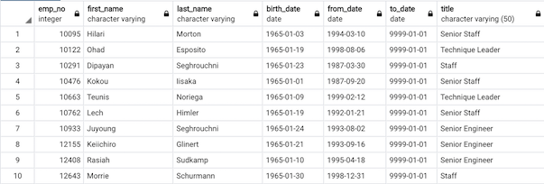

# Pewlett-Hackard-Analysis
An analysis of the Pewlett Hackard company

## Project Overview

My client Bobby has proven his SQL chops, his manager has given both of us two more assignments: determine the number of retiring employees per title, and identify employees who are eligible to participate in a mentorship program. Then, we’ll write a report that summarizes our analysis and helps prepare Bobby’s manager for the “silver tsunami” as many current employees reach retirement age. 

## Resources
The Pewlett-Hackard-Analysis module uses PostgreSQL which required pgAdmin to be installed. Visit the [PostgresSQL download website](https://www.enterprisedb.com/downloads/postgres-postgresql-downloads)
 to initiate your download
  
- **Data Source:** [departments.csv](/Data/departments.csv), [dept_emp.csv](/Data/dept_emp.csv), [dept_manager.csv](/Data/dept_manager.csv), [employees.csv](/Data/employees.csv), [salaries.csv](/Data/salaries.csv), [titles.csv](/Data/titles.csv)
- **Software:** Postgres, pgAdmin  

For more about PostgreSQL, visit:  
- The PostgreSQL documentation
 https://www.postgresql.org/docs/manuals/  
- The PostgreSQL tutorial
 https://www.tutorialspoint.com/postgresql/

## Objectives 
- Determine the number of retiring employees per title, and identify employees who are eligible to participate in a mentorship program. 
- Write a report that summarizes my analysis and helps prepare Bobby’s manager for the “silver tsunami” as many current employees reach retirement age. 
- Create and use a SQL database.
- Import and export large CSV files.
- Practice using different joins to create new tables in pgAdmin.

## ERD Creation and logistics

There are three forms of ERDs: conceptual, logical, and physical. The creation of a flowchart helps us visualize and efficiently map out how our database is structured.

## Challenge Summary

Using the ERD we created in this module with Bobby as a reference and our knowledge of SQL queries and other information gathered, we ultimately created a mentorship-eligibility table that holds the current employees who were born between January 1, 1965 and December 31, 1965. 

#### Creation of Retirement Titles table

#### Creation of Unique Titles table

#### Determining Who Is Eligible For The Company's Mentorship Program

## Challenge Conclusion and Objective Results

The creation of a table that displayed what employees are eligible to participate in the company's mentorship program concluded our analysis and assisted us in solving the problem of the upcoming "silver tsunami" and thus aided Bobby's manager in future proofing Pewlett-Hackard.
